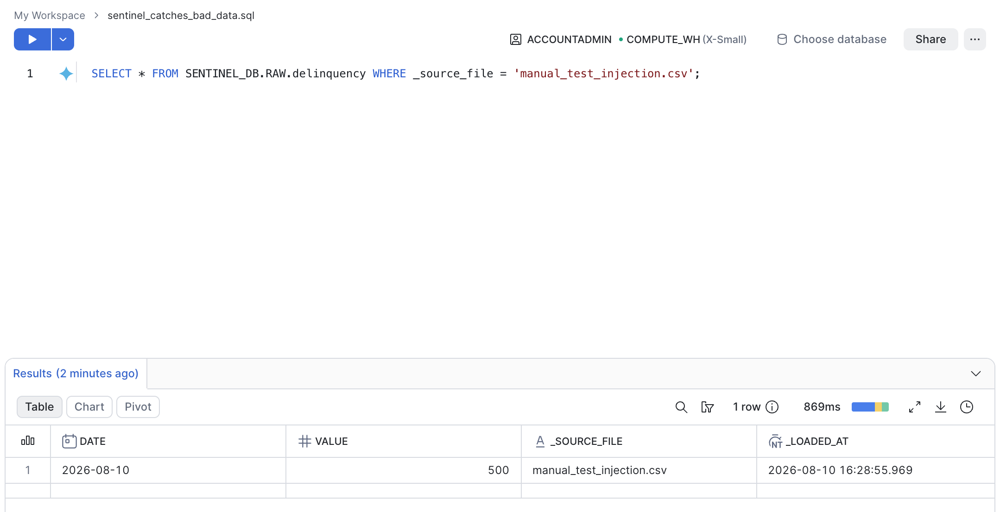
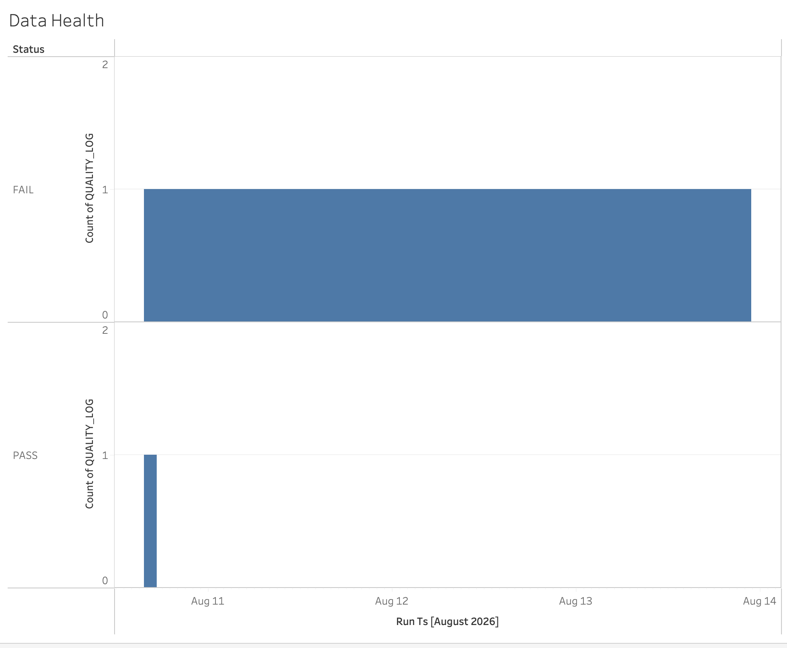
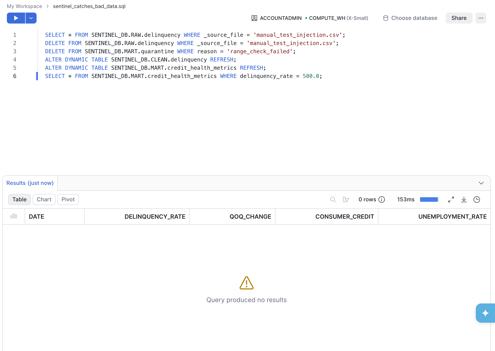
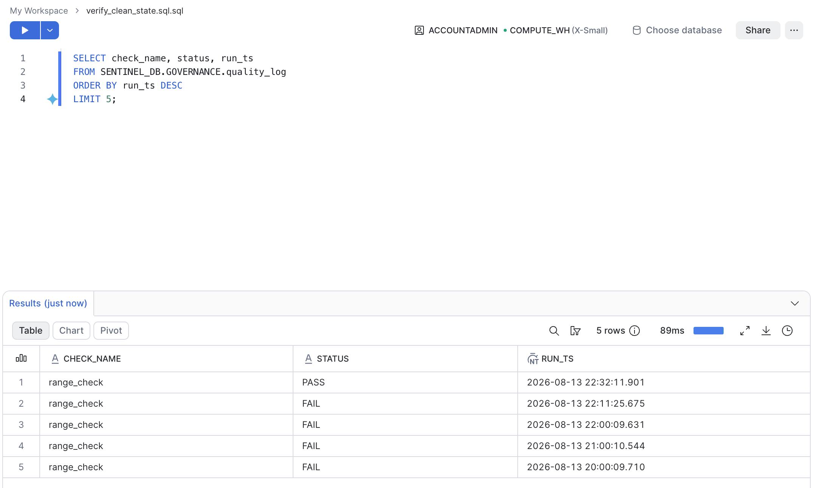
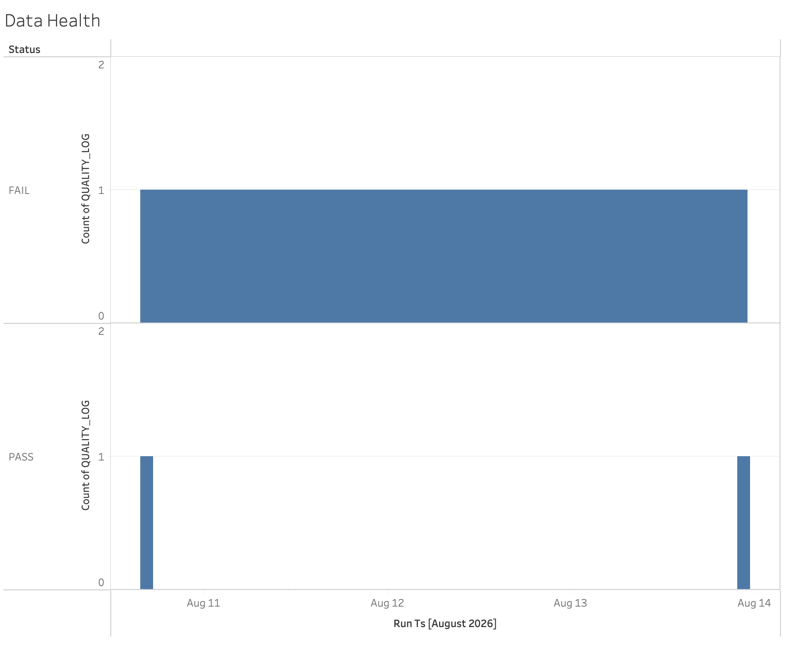

# Sentinel — Self-Healing Credit Data Quality Pipeline

A financial data pipeline that ingests real credit delinquency data, transforms it autonomously, checks it against deterministic quality rules, quarantines anything that fails, and has an LLM agent explain why — all on a schedule, with zero manual intervention.

**Architecture claim:** Deterministic SQL checks decide whether data is trustworthy. The LLM agent only explains failures a rule already caught — so a hallucination can produce a bad sentence, never a bad decision.

---

## What it does

1. **Ingests** credit card delinquency, consumer credit, and unemployment data from FRED (Federal Reserve Economic Data)
2. **Lands** it in versioned AWS S3 as an immutable raw layer
3. **Transforms** it autonomously through Snowflake Dynamic Tables — RAW → CLEAN → MART, self-refreshing hourly, no manual triggers
4. **Checks** every refresh against deterministic rules: null checks, range checks, and 2-sigma statistical anomaly detection
5. **Quarantines** anything that fails, so bad data never reaches the dashboard-facing view
6. **Explains** each failure in plain English via an LLM agent (Python + Groq) — triggered only after a rule has already failed, never deciding pass/fail itself
7. **Orchestrates** the whole chain via Apache Airflow, running hourly with zero manual steps
8. **Visualizes** the result in a live Tableau dashboard connected directly to Snowflake

## Architecture

~~~
FRED API → S3 (raw, versioned)
         → Snowflake RAW (exact copy)
         → Snowflake CLEAN (Dynamic Table, typed + validated)
         → Snowflake MART (Dynamic Table, business metrics)
              ├─→ credit_health_clean (view, dashboard-safe)
              └─→ quarantine (failed rows + reason)
                        ↓
              quality_log (audit trail, every check run)
                        ↓
              incident_log (LLM root-cause narrative)
                        ↓
              Tableau (live dashboard)

Orchestrated hourly by Apache Airflow.
~~~

## Why this design

- **RAW/CLEAN/MART separation** gives a provable lineage trail — every number on the dashboard can be traced back to its raw source file and load timestamp.
- **Dynamic Tables are read-only** by design, so the pipeline can't simply delete bad rows from the transformed layer. Instead, a `quarantine` table holds failed rows, and a `credit_health_clean` *view* excludes anything in quarantine — the autonomous data layer stays untouched, and a separate "safe to show" layer enforces trust.
- **The LLM never decides pass/fail.** All checks are deterministic SQL. The agent is invoked only after a check has already failed, and its only job is to explain the failure in plain English using recent data as context.
- **Airflow orchestrates cross-system steps** (Snowflake SQL → external Python/LLM API) that Snowflake's own Task scheduler can't chain natively.
- **Every check and schema comment doubles as data governance** — `quality_log` is a permanent audit trail of every check ever run, and table/column comments (via `COMMENT ON`) keep the data dictionary living inside the schema itself rather than in a separate doc that goes stale.

## Stack

Python · AWS S3 · Snowflake (Dynamic Tables, Tasks) · Groq (LLM) · Apache Airflow · Tableau

## Proof it works

On Day 6, a deliberately invalid row (delinquency_rate = 500, impossible for a percentage) was injected into RAW.delinquency to test the quality gate. It stayed in place for several days while the pipeline ran autonomously every hour, a real, sustained test rather than a one off catch.

### The bad data, confirmed at the source



A delinquency rate of 500 is impossible (it is a percentage, bounded 0 to 100), confirming this was a genuine invalid value sitting in the raw layer, not a display artifact.

### Before: the gate catching the same bad data, every hour, for days



The FAIL bar spans the entire visible timeline (Aug 10 to 14). This is proof it wasn't a single lucky catch, but the deterministic range_check correctly flagging the same invalid row on every scheduled run, hour after hour, with zero manual intervention.

### The cleanup, and confirming it actually took



After removing the bad row from RAW and forcing the Dynamic Tables to refresh, this query checking MART.credit_health_metrics for the invalid value returns zero rows, confirming the fix propagated all the way through the pipeline.

### After: the very next check passes



The same range_check that failed consistently for days logs a clean PASS the moment the underlying data is fixed. No code change, no redeploy, just the existing deterministic logic correctly reflecting the new state of the data.

### After: the dashboard reflects it



The historical FAIL count is preserved, since an audit log should never silently erase what actually happened, while a new PASS appears at the end of the timeline representing the pipeline's current, healthy state.

## Known limitations

- The range check currently re-flags the same underlying bad row on every scheduled run it's still present, rather than only once — a production version would deduplicate by row rather than by check execution.
- Cortex (Snowflake's native LLM function) was the original plan but is restricted on trial accounts without a payment method; the agent runs via an external LLM API (Groq) instead, called from Python and orchestrated by Airflow.
- Tableau's dashboard reflects a snapshot at last refresh, not a live stream — the *pipeline* is autonomous and self-healing; the dashboard is a window into it that updates when refreshed, same as most BI tools.

## Setup

```bash
python -m venv venv
source venv/bin/activate
pip install -r requirements.txt
```

Configure AWS CLI (`aws configure`) and set Snowflake/Groq credentials in a `.env` file before running `ingest.py`, `upload.py`, or `investigate.py`.
